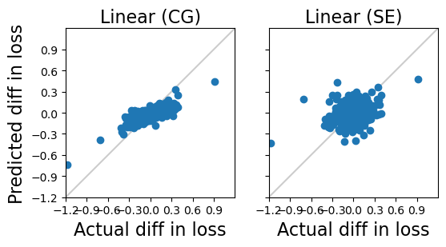
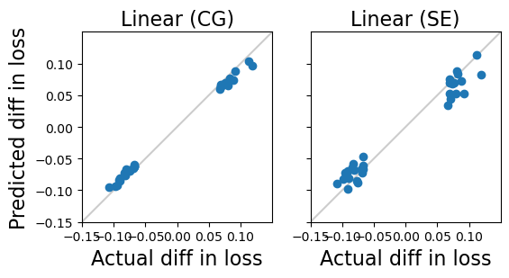
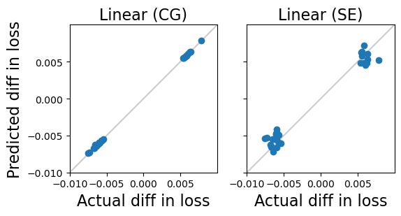

# Reproducing Influence Functions with PyTorch

This repository aims to reproduce **Figure 2** from the paper [*Understanding Black-box Predictions via Influence Functions*](https://arxiv.org/pdf/1703.04730) using PyTorch.

In the original work, the authors use TensorFlow on MNIST dataset to compute influence functions efficiently by estimating Hessian-vector products (HVPs) via **Conjugate Gradients** and **Stochastic Estimation**. These methods approximate Equation (2) in the paper, estimating the loss difference for a given test data point after removing specific training samples.

In this project, I reimplement the approach in PyTorch. To validate the correctness and robustness of the code, I apply the code not only on MNIST dataset but also to additional random datasets both in same and smaller model.

## Experiments

### 1. One-Layer Network on MNIST

Following the experimental setup in the paper, I set a single-layer linear network (784 input dimensions, 10 output classes, no bias) trained on the MNIST dataset. And check the top 500 data points with largest influence. The below picture shows comparisons between Conjugate Gradients and Stochastic Estimation with the real loss differences:  

Please refer to [`fig2_reproduce.ipynb`](./fig2_reproduce.ipynb) for details.

---

### 2. Same Model on a Random Dataset

To further evaluate generalization, I generated a random dataset with the same structure as MNIST (input dimension 784, 10 output classes). The below picture shows comparisons between Conjugate Gradients and Stochastic Estimation with the real loss differences:  

Please refer to [`random_samples.ipynb`](./random_sample.ipynb) for details.

---

### 3. Smaller Model on a Random Dataset

To test the robustness of the code under different model, I also experimented with a smaller model (8 input dimensions, 2 output classes) on a newly generated random dataset. The below picture shows comparisons between Conjugate Gradients and Stochastic Estimation with the real loss differences:

Please refer to [`small_model.ipynb`](./small_model.ipynb) for details.

